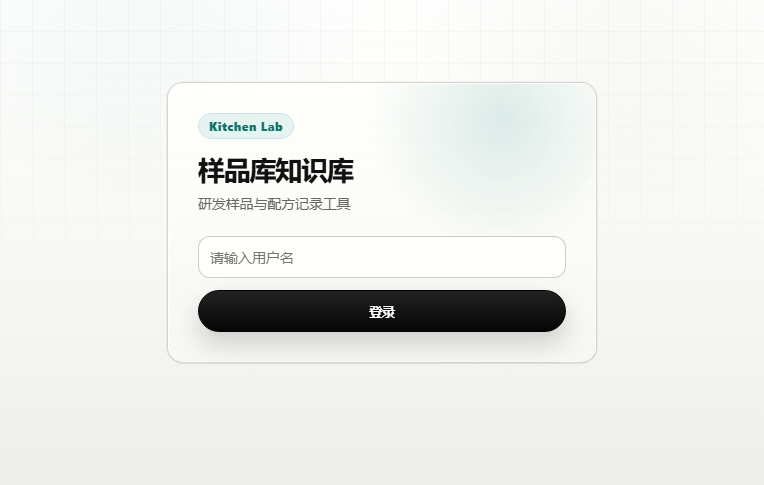
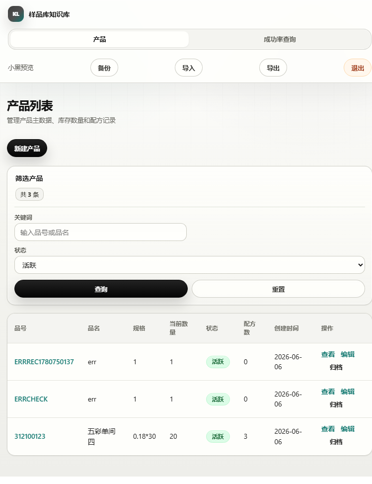
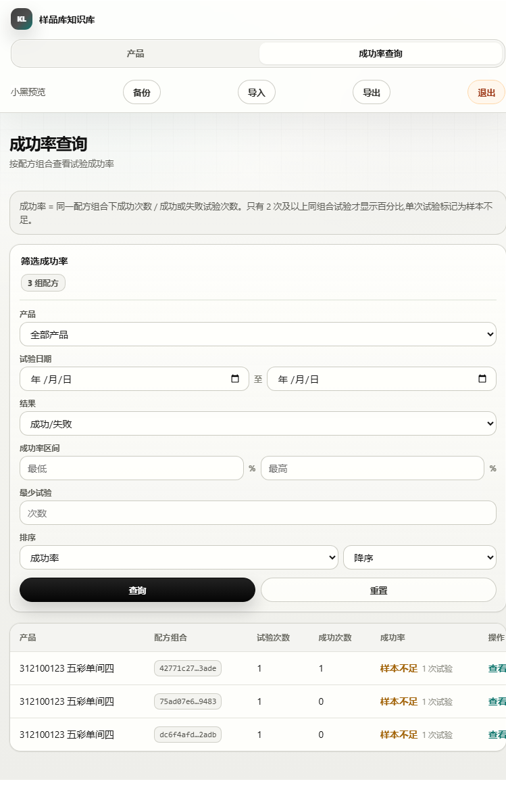
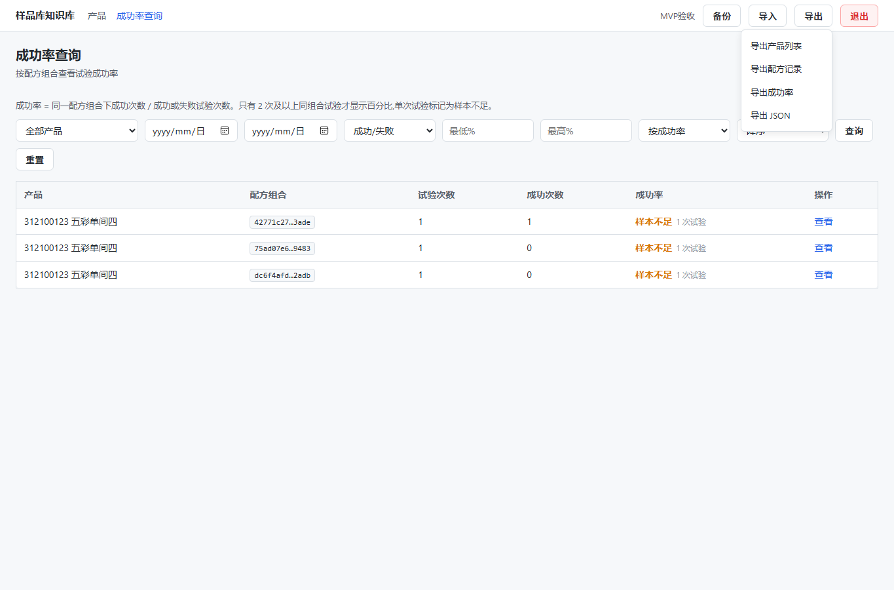
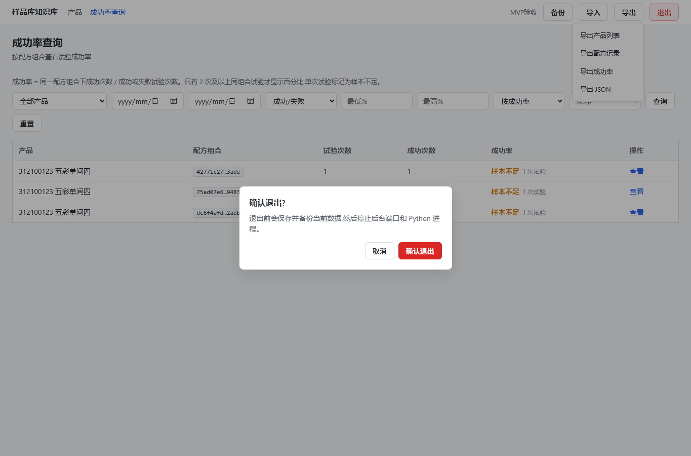
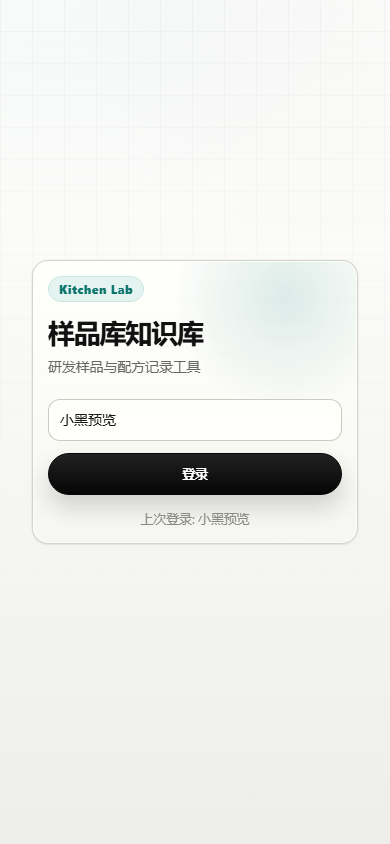
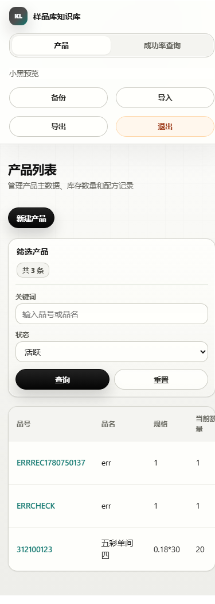

# 样品库知识库管理系统

轻量、易迁移的本地样品库知识库系统，用于记录产品主数据、研发试验配方、配方组合历史和成功率。当前版本作为 MVP 可用版，适合在 Windows 电脑上本地运行和整体迁移。

## 当前交付状态

- 应用入口、数据库、导入导出、备份和退出流程已经打通。
- 前端已完成工作台式重构：左侧导航 + 顶部系统栏 + 主任务区的单页工作台结构，侧边栏与图标已替换为本地 SVG，布局在放大/还原窗口时稳定不抖。
- `dependencies/` 已放入本地 Python 依赖包，可用于无网络环境安装。
- `docs/兴达样品库知识库使用指南.docx` 是给日常使用者看的图文说明；本 README 面向安装、迁移和维护。

## 主要功能

- 产品管理：维护品号、品名、规格、当前数量、状态和备注。
- 配方记录：按产品记录试验日期、配方名称、原料辅料、状态、用量和备注。
- 配方复制：从已有配方快速生成一条待观察复测记录，保留原料辅料组合。
- 原料查询：配方列表支持按原料/辅料名称反查，录入时会提示常用原料和单位。
- 库存流水：支持在产品详情中调整库存，并记录变动前后、原因和操作人。
- 成功率查询：按同一产品、同一配方组合统计试验次数、成功次数和成功率，并支持最小试验次数筛选。
- 数据校验：限制非法状态、负数库存/用量，并对不存在的记录返回明确错误。
- 备份：将当前数据库打包到 `backups/`，保留安全恢复点；数据库缺失时不会生成空备份。
- 导出：将产品列表、配方记录、成功率、导入模板或 JSON 数据导出到 `exports/` 专用目录。
- 导入：支持导入本系统导出的 JSON 文件或备份 ZIP，导入前会自动备份当前数据库。
- 退出：页面右上角“退出”会确认后备份当前数据，并停止后台端口和 Python 进程。
- 离线依赖：`dependencies/` 存放 Windows 迁移时可直接安装的依赖包，已覆盖 `requirements.txt` 中的顶层依赖。

## 界面预览

### 登录页



### 产品工作台



### 成功率查询



### 导出菜单



### 退出确认



### 移动端适配

<p>
  
  
</p>

更多操作截图见 [`docs/screenshots/`](docs/screenshots/)，完整图文说明见 [`docs/兴达样品库知识库使用指南.docx`](docs/兴达样品库知识库使用指南.docx)。

## 桌面工作台重构说明

- 当前前端已完成桌面工作台重构，主流程统一到“左侧导航 + 顶部系统操作 + 主任务区”的单页工作台结构。
- 登录页、产品列表、产品详情、配方录入、配方详情和成功率页面都已切换到统一的 `page-hero` 与面板式布局。
- 侧边栏图标已从远程 CDN 图标字体替换为本地 SVG，避免网络依赖，且在任何窗口尺寸下渲染稳定。
- 库存调整已从浏览器原生 `prompt` 改为站内弹层，错误提示、导出菜单、Toast 提示和空状态也已统一到共享组件。
- 桌面端优先保证高频录入、筛选和详情查看效率；窄屏下保留响应式布局，方便在较小窗口中继续使用。
- 这次重构不改变现有后端 API、数据库结构和导入导出目录，迁移与备份方式保持不变。

## 快速启动

Windows 日常使用推荐直接双击：

```text
兴达样品库知识库.lnk
```

也可以双击启动脚本：

```text
启动样品库知识库.bat
```

启动脚本会执行这些动作：

1. 进入项目目录。
2. 检查 Python 依赖是否已安装。
3. 如缺少依赖，优先从 `dependencies/` 离线安装。
4. 使用 `pythonw.exe` 或 `python.exe` 启动 `startup.py`。
5. 打开本地系统页面，默认地址为 `http://127.0.0.1:7777/`。

首次启动如果需要安装依赖，可能会比平时慢一些。若没有自动弹出页面，可手动访问：

```text
http://127.0.0.1:7777/
```

启动后不要关闭自动打开的后台窗口或命令行窗口；日常退出请用页面右上角“退出”或 Windows 窗口关闭按钮，系统都会先提示并做一次备份。

## 登录

系统采用简单用户名登录，不设置密码。输入的用户名会用于记录创建人和登录记录。

## 手动运行

已安装依赖后，可用命令行启动：

```bash
python startup.py
```

开发调试可使用：

```bash
uvicorn app:app --reload --host 127.0.0.1 --port 7777
```

首次手动安装依赖：

```bash
pip install -r requirements.txt
```

如果目标电脑无法联网，可使用本地依赖目录：

```bash
python -m pip install --no-index --find-links dependencies -r requirements.txt
```

### 本地依赖是否齐全

当前 `requirements.txt` 顶层依赖为：

```text
fastapi
uvicorn[standard]
pywebview
openpyxl
pydantic
```

`dependencies/` 中已经包含这些包及其运行所需的传递依赖。可用下面命令做离线安装验证：

```bash
python -m pip install --no-index --find-links dependencies -r requirements.txt
```

如果命令提示某个包 `No matching distribution found`，说明当前电脑的 Python 版本或系统架构与本地 wheel 不匹配，或依赖目录不完整。此项目当前依赖包主要面向 Windows + Python 3.14 x64 环境准备。

## 导出目录

导出文件集中放在 `exports/`，便于识别和取用：

```text
exports/
  产品列表/
  配方记录/
  成功率/
  导入模板/
  JSON数据/
  _latest/
```

其中 `_latest/` 会保存每类导出的最新文件。历史导出文件仍保留在对应分类目录中。

## 导入说明

页面顶部点击“导入”，可选择：

- JSON：由“导出 JSON”生成的数据文件。
- ZIP：由“备份”生成的数据库备份包。

导入会替换当前数据库，不是追加合并。系统会在导入前自动备份当前数据库，降低误操作风险。

建议导入前先手动点击一次“备份”，并确认 `backups/database/` 里出现新的 ZIP 文件。数据库备份只保留最新 5 份，新的备份会自动覆盖最旧的数据。

## 退出系统

点击页面右上角红色“退出”按钮，或点击 Windows 窗口关闭按钮：

- 取消：停留在当前页面，不做退出操作。
- 确认退出：先备份当前数据库，再停止后台端口和 Python 进程。

## 数据和文件结构

```text
data/kitchen.db              本地 SQLite 数据库
backups/database/            数据库备份 ZIP（仅保留最新 5 份）
backups/_历史散文件/          自动收纳旧版根目录散文件
exports/                     Excel 和 JSON 导出文件
dependencies/                离线依赖包
docs/                        使用指南和截图
logs/                        启动和运行日志
兴达样品库知识库.lnk          Windows 快捷启动入口
启动样品库知识库.bat          Windows 启动脚本
兴达logo.ico                 Windows 图标
```

`data/`、`backups/`、`exports/`、`logs/` 属于运行数据目录，默认不纳入 Git 版本管理。

如果要给别人拷贝一个可用版本，请保留整个目录结构，不要只拷贝 `app.py` 或数据库文件。

## 迁移到其他电脑

迁移时复制整个项目文件夹，不要只复制单个程序文件。建议至少带上：

- `data/`
- `dependencies/`
- `backups/`
- `exports/`
- `兴达样品库知识库.lnk`
- `启动样品库知识库.bat`
- `兴达logo.ico`

到新电脑后双击 `兴达样品库知识库.lnk` 启动。若依赖缺失，启动脚本会尝试从 `dependencies/` 安装。

推荐迁移步骤：

1. 在旧电脑页面右上角点击“退出”，让系统自动备份并停止后台。
2. 复制整个 `kitchen-lab-kb` 文件夹到 U 盘或新电脑。
3. 在新电脑确认已安装 Python，并可在命令行运行 `python --version`。
4. 双击 `兴达样品库知识库.lnk`。
5. 如果页面没有自动打开，访问 `http://127.0.0.1:7777/`。
6. 登录后检查产品列表、导出和备份是否正常。

## 使用指南

更完整的图文说明见：

```text
docs/兴达样品库知识库使用指南.docx
```

文档建议分工：

- README：给维护者看，说明如何启动、迁移、离线安装依赖和排查问题。
- 使用指南 Word：给实际录入人员看，说明页面怎么操作。
- `dependencies/README.md`：给安装维护人员看，说明本地依赖目录如何使用。

## 常见问题

### 双击后页面没有打开

先等待 10 到 30 秒。如果仍未打开，查看：

```text
logs/launcher.log
logs/startup.log
```

也可以手动访问：

```text
http://127.0.0.1:7777/
```

### 端口被占用

优先在页面右上角点击“退出”。如果页面无法打开，可重启电脑后再启动。

也可以在命令行检查端口：

```powershell
Get-NetTCPConnection -LocalPort 7777 -ErrorAction SilentlyContinue
```

### 导入失败

确认导入文件是本系统导出的 JSON，或 `backups/` 中生成的 ZIP 备份。

### 导出后找不到文件

优先查看：

```text
exports/_latest/
```

### 离线安装依赖失败

先确认 `dependencies/` 不为空，并包含 `.whl` 或 `.tar.gz` 文件。再运行：

```powershell
python -m pip install --no-index --find-links dependencies -r requirements.txt
```

如果仍失败，重点核对 Python 版本、Windows 位数和报错中缺失的包名。

## 测试

本地检查可运行：

```bash
Get-ChildItem tests\check_*.py | ForEach-Object { python $_.FullName }
python -m py_compile startup.py app.py export.py import_data.py shutdown.py auth.py backup.py db.py
```
